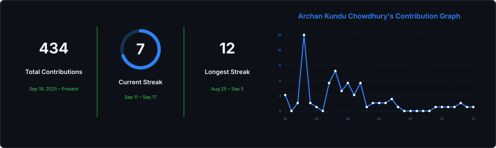

  

###

  

  

  

  

  

  

###

<h1 data-importer="text" align="center">Hi there 👋 I am Archan Kundu Chowdhury</h1>

###

<h3 data-importer="text" align="left">About Me</h3>

- Currently building **[FitVision](https://github.com/Archan47/FitVison-AI-powered-Fitness-Assistant)** — an AI-powered fitness assistant
- Currently learning **DevOps** and **Generative AI**
- Comfortable across the stack — React / GSAP / Three.js on the frontend, Flask / Spring on the backend, and PyTorch / scikit-learn for ML
- Write about my projects and ML deep-dives on **[Medium](https://medium.com/@chowdhuryarchan76)**
- All my projects live on my **[Portfolio](https://archan47.github.io/Portfolio-Latest/)**
- Reach me at **chowdhuryarchan20021@gmail.com**

###

## Some Things I've Built

| Project | What it is |
|---|---|
| **[FitVision](https://github.com/Archan47/FitVison-AI-powered-Fitness-Assistant)** | AI-powered fitness assistant |
| **Agroveda** | Agri-tech platform — a React + Firebase web app paired with an ESP32-based IoT layer for soil-moisture and motion sensing |
| **HR Management System** | Full-stack HR platform (React + Flask), built for the Odoo Hackathon |
| **ML From Scratch** | An ongoing series implementing KNN, Naive Bayes, and Decision Trees from first principles — each one written up as a blog post |

More on my **[Portfolio →](https://archan47.github.io/Portfolio-Latest/)**

<h3 data-importer="text" align="left">Web Dev Languages & Frameworks</h3>

###

  
  
  
  
  
  
  
  
  
  
  
  
  
  
  
  
  
  
  
  
  
  
  
  
  
  
  

###

<h3 data-importer="text" align="left">ML , Data Science & GenAI</h3>

###

  
  
  
  
  
  
  
  
  
  
  

###

<h3 data-importer="text" align="left">Databases</h3>

###

  
  
  
  
  
  
  
  
  
  
  

###

<h3 data-importer="text" align="left">DevOps & Tools</h3>

###

  
  
  
  
  
  
  
  
  
  
  
  
  

###

<h3 align="left">GitHub Stats</h3>

  

###

<h3 align="left">My Blogs</h3>

  

  

  

  

###

  

